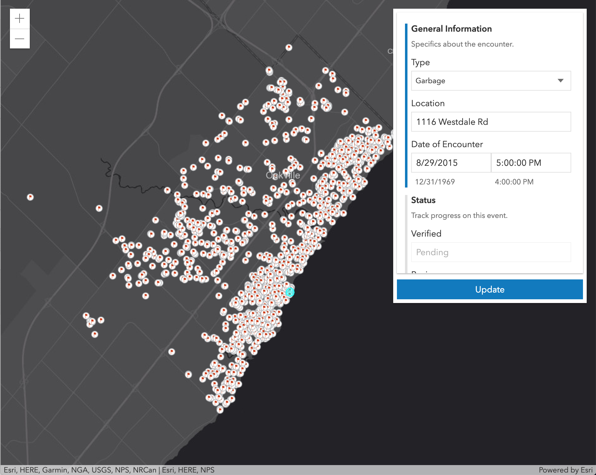
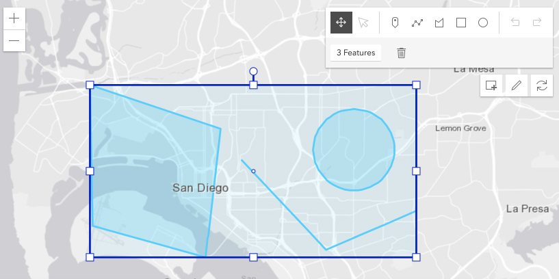

<!-- .slide: data-background="../node_modules/esri-reveal.js-templates/img/2019/uc/bg-1.png" data-background-size="cover" -->

# Editing with the ArcGIS API for JavaScript

##### Bjorn Svensson, Heather Gonzago, JC Franco

&nbsp;

👉 <small>Slides & demos: https://bit.ly/editinguc19 </small>👈

&nbsp;

---

<!-- .slide: data-background="../node_modules/esri-reveal.js-templates/img/2019/uc/bg-3.png" data-background-size="cover" -->

## Agenda

* Web editing
* Editor widget
* Different workflows
* Q&A

---

<!-- .slide: data-background="../node_modules/esri-reveal.js-templates/img/2019/uc/bg-2.png" data-background-size="cover" -->

## Data in a feature service

* One or more feature layers
* Editable

---

<!-- .slide: data-background="../node_modules/esri-reveal.js-templates/img/2019/uc/bg-2.png" data-background-size="cover" -->

## Edit your feature layer

<a href="https://developers.arcgis.com/rest/services-reference/feature-service.htm">ArcGIS REST API<a>

ArcGIS Online

ArcGIS API for Python

ArcGIS API for JavaScript

---

<!-- .slide: data-background="../node_modules/esri-reveal.js-templates/img/2019/uc/bg-2.png" data-background-size="cover" -->

## Web editing in the browser

1. What to add: [FeatureTemplates](http://developers.arcgis.com/javascript/latest/api-reference/esri-widgets-FeatureTemplates.html)
2. Geometry: [Sketch](http://developers.arcgis.com/javascript/latest/api-reference/esri-widgets-Sketch.html)
3. Fields/attributes: [FeatureForm](http://developers.arcgis.com/javascript/latest/api-reference/esri-widgets-FeatureForm.html)
4. [FeatureLayer.applyEdits](http://developers.arcgis.com/javascript/latest/api-reference/esri-layers-FeatureLayer.html#applyEdits)

5. Editor widget

---

<!-- .slide: data-background="../node_modules/esri-reveal.js-templates/img/2019/uc/bg-3.png" data-background-size="cover" -->

## Editor widget

---

# Different Workflows

---

<!-- .slide: data-background="../node_modules/esri-reveal.js-templates/img/2019/uc/bg-3.png" data-background-size="cover" -->

## Form-based

☝ `FeatureForm`

---

## [`FeatureForm`](https://developers.arcgis.com/javascript/latest/api-reference/esri-widgets-FeatureForm.html)

* Renders input fields from attributes<!-- .element: class="fragment" data-fragment-index="1" -->
* Configurable<!-- .element: class="fragment" data-fragment-index="2" -->
  * Field order
  * Label/description
  * Groups
  * Visibility expression

---

## `FeatureForm` Demo

---

## Putting it all together

Use case: Report Bike Theft

---

<!-- .slide: data-background="../node_modules/esri-reveal.js-templates/img/2019/uc/bg-3.png" data-background-size="cover" -->

# Geometry-based

☝ `Sketch`

---

<!-- .slide: data-background="../node_modules/esri-reveal.js-templates/img/2019/uc/bg-3.png" data-background-size="cover" -->

## Sketching

* <a href="https://developers.arcgis.com/javascript/latest/api-reference/esri-widgets-Sketch.html" target="_blank">`Sketch`</a> and <a href="https://developers.arcgis.com/javascript/latest/api-reference/esri-widgets-Sketch-SketchViewModel.html" target="_blank">`SketchViewModel`</a>

* Provides ability to manipulate geometries
* The widget provides out-of-the-box tools for creating and updating graphics
  * point, polyline, polygon, rectangle and circle geometries
* Keyboard shortcuts

---

<!-- .slide: data-background="../node_modules/esri-reveal.js-templates/img/2019/uc/bg-3.png" data-background-size="cover" -->

## Editor or Sketch?

* Use `Sketch` in place of Editor for customized workflows, e.g.
  * Create own custom tool that Editor does not yet have, e.g. `Cut`
  * Updating multiple geometry types simultaneously

---

<!-- .slide: data-background="../node_modules/esri-reveal.js-templates/img/2019/uc/bg-3.png" data-background-size="cover" -->

## Sketch is configurable

* Tool options (create and update)
* Internal view listener for activating update workflows
  * Any graphics assigned to the GraphicsLayers assigned to Sketch are candidates for updating
  * No need to write extra code to check if graphic passed to the layer exists, it's automatic

---

<!-- .slide: data-background="../node_modules/esri-reveal.js-templates/img/2019/uc/bg-3.png" data-background-size="cover" -->

### SketchViewModel with applyEdits
Use case: Single polygon tool used to create and delete

---

<!-- .slide: data-background="../node_modules/esri-reveal.js-templates/img/2019/uc/bg-3.png" data-background-size="cover" -->

### Sketch widget with applyEdits
Use case: Updating multiple geometries at once

---

<!-- .slide: data-background="../node_modules/esri-reveal.js-templates/img/2019/uc/bg-3.png" data-background-size="cover" -->

### Sketch with custom tools
Use case: Custom sketch tool functionality using GeometryEngine

---

<!-- .slide: data-background="../node_modules/esri-reveal.js-templates/img/2019/uc/bg-3.png" data-background-size="cover" -->

### Sketch with custom snapping and validation
Use case: Customize with snapping and validation

---

<!-- .slide: data-background="../node_modules/esri-reveal.js-templates/img/2019/uc/bg-3.png" data-background-size="cover" -->

## Recap

* Web editing
* Editor widgets
* Different workflows

---

## Additional Resources

- [JavaScript API SDK](https://developers.arcgis.com/javascript/)
- [Arcade - expression language](https://developers.arcgis.com/javascript/latest/guide/arcade/index.html)

---

<!-- SURVEY SLIDE: -->
<!-- .slide: data-background="Images/alias_slide.png"> -->

---

<!-- SURVEY SLIDE: -->
<!-- .slide: data-background="../node_modules/esri-reveal.js-templates/img/2019/uc/bg-5.png" data-background-size="cover" -->

---

## Questions?

##### For example

> 🤔 Where can I find the slides/source?

👉 [bit.ly/editinguc19](http://bit.ly/editinguc19) 👈

---

<!-- .slide: data-background="../node_modules/esri-reveal.js-templates/img/2019/uc/bg-4.png" data-background-size="cover" -->

## Thank You!
